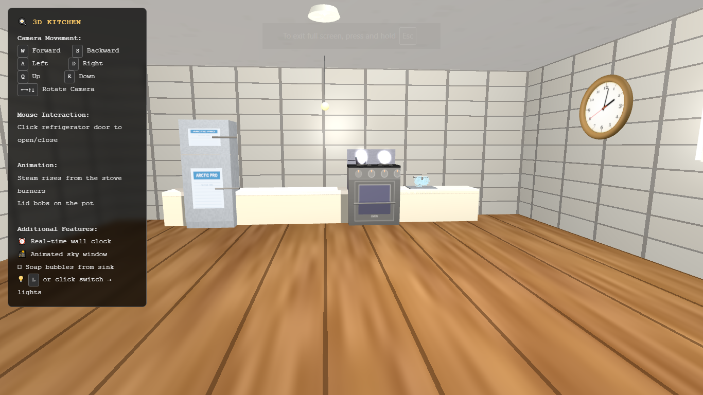
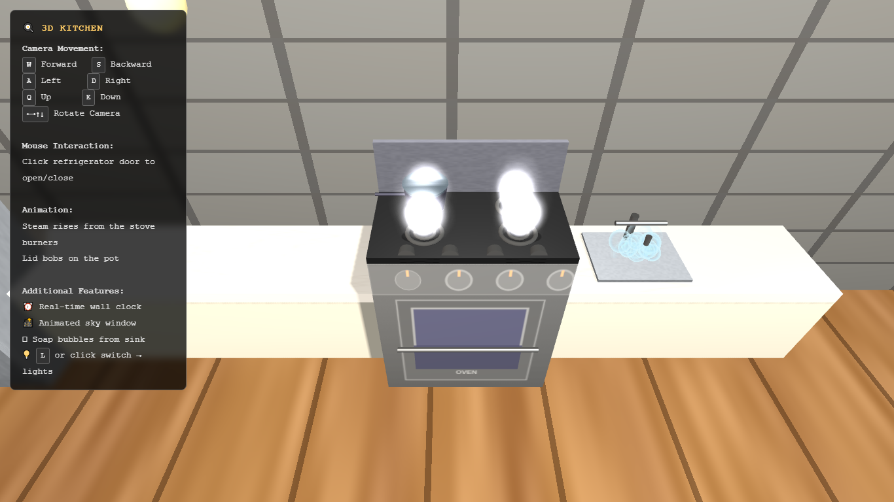
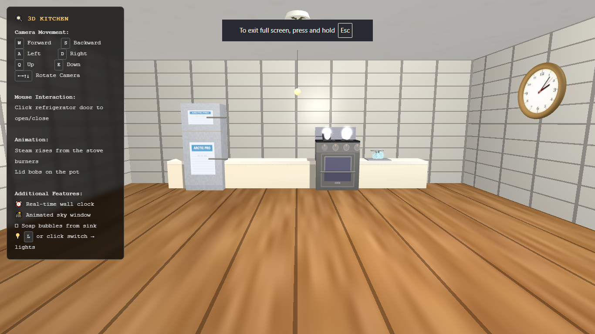

# 🍳 3D Kitchen

An interactive 3D kitchen scene built with **Three.js** and **WebGL**, running entirely in the browser as a single HTML file.

## Preview





A first-person walkthrough of a fully furnished kitchen featuring a refrigerator, stove with animated burners, sink with soap bubbles, a real-time wall clock, and a skylight window.

## Features

| Feature | Detail |
|---|---|
| 🚶 Camera movement | WASD + Q/E + mouse drag |
| 🚪 Interactive fridge door | Click to open/close |
| 💨 Steam animation | Rises from stove burners |
| 🍲 Lid animation | Bobs on pot |
| 🫧 Soap bubbles | Float from sink |
| 🕐 Real-time clock | Shows actual current time |
| 🌤️ Animated sky window | Dynamic sky on ceiling |
| 💡 Toggleable lights | Press `L` or click light switch |

## Controls

**Camera Movement**
- `W` / `S` — Forward / Backward
- `A` / `D` — Left / Right
- `Q` / `E` — Up / Down
- `←→` drag — Rotate camera

**Mouse**
- Click refrigerator door → open/close

**Keyboard**
- `L` — Toggle lights on/off

## How to Run

Just open `CG PROJECT CODE.html` in any modern browser. No server or install needed.

```bash
# Option 1: double-click the file
CG PROJECT CODE.html

# Option 2: serve locally (avoids CORS issues)
python -m http.server 8000
# then open http://localhost:8000
```

## Tech Stack

- [Three.js](https://threejs.org/) — 3D rendering
- Custom GLSL shaders
- Vanilla JS / HTML5 Canvas

